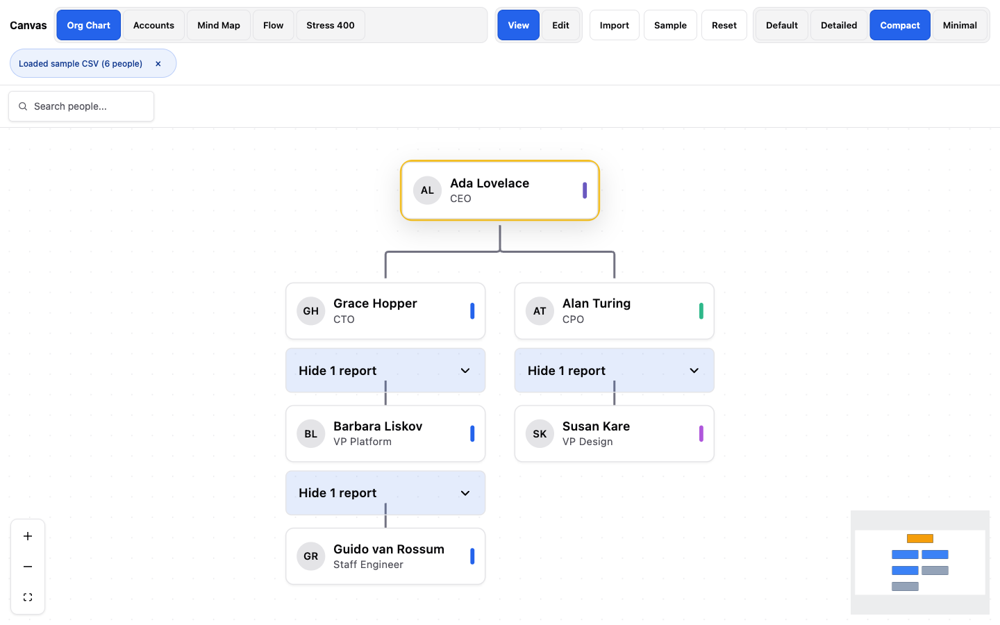
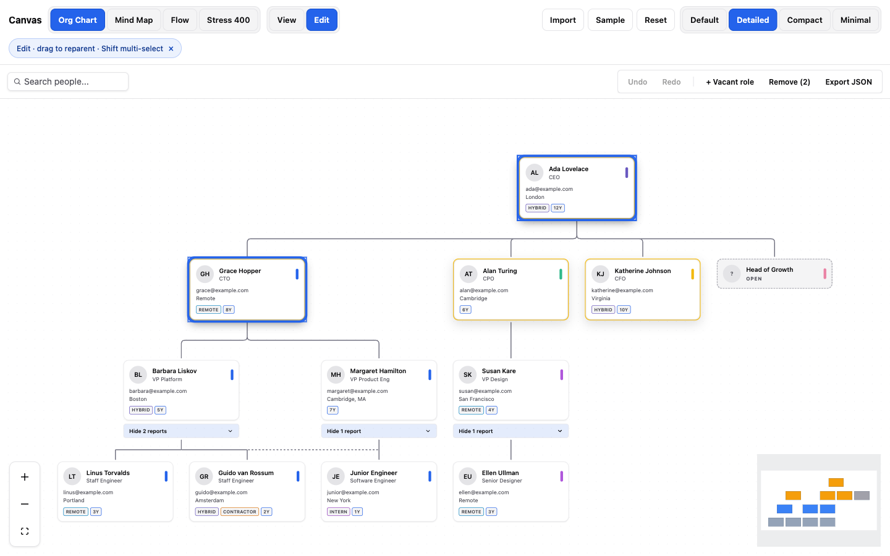
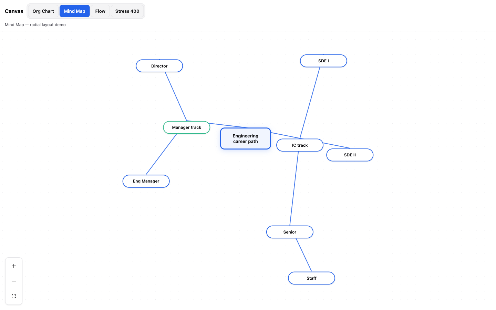
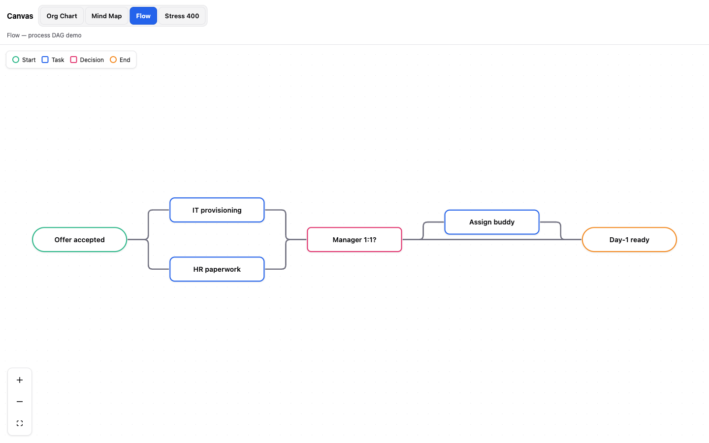
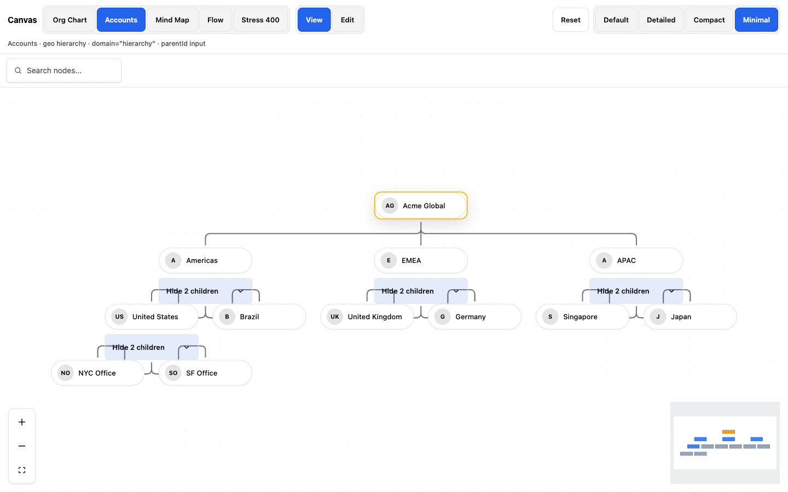

# Ananse

**The design-forward library for hierarchies and flows.**

Install once, render a production org chart in minutes — typed people data in, HR-ready UI out. Built on React and [xyflow](https://xyflow.com/), without the weeks of node, layout, and chrome work.

[](LICENSE)
[](#install)
[](#packages)

<p align="center">
  
</p>

<p align="center">
  <a href="#quickstart"><strong>Quickstart</strong></a> ·
  <a href="#features"><strong>Features</strong></a> ·
  <a href="#examples"><strong>Examples</strong></a> ·
  <a href="#packages"><strong>Packages</strong></a> ·
  <a href="#recipes"><strong>Recipes</strong></a> ·
  <a href="#faq"><strong>FAQ</strong></a>
</p>

---

## Why Ananse

| Need | Raw React Flow | Enterprise SKUs | **Ananse** |
|------|----------------|-----------------|------------|
| Beautiful org chart tomorrow | Weeks of glue | License + lock-in | **Minutes** |
| HR domain (vacant roles, badges) | DIY | Generic | **Built-in** |
| CSV / HRIS-shaped import | DIY | Vendor adapter | **`loadOrg`** |
| Light editor (reparent, undo) | DIY | Heavy suite | **`mode="edit"`** |
| Mind map + process flow | Separate libs | Extra SKUs | **One kit** |
| License | MIT | Proprietary | **MIT** |

---

## Features

- **Org charts that look shipped** — pan/zoom, collapse, search, focus, keyboard, minimap, density presets
- **Edit mode without glue** — reparent, multi-select, vacant roles, inspector, undo/redo, export
- **People *and* generic trees** — HR org chart or accounts / products / geo with `domain="hierarchy"`
- **Data in, chart out** — `loadOrg` for employees JSON, CSV, HRIS-shaped, and nested payloads
- **Mind map & flow** — `<MindMap>` and `<FlowBuilder>` in the same kit
- **Tokens auto-inject** — no CSS import required; override with CSS variables when you want
- **Extensible** — custom cards, node/edge types, layout, i18n labels, light plugins

---

## Install

```bash
pnpm add @ananse/react @ananse/core @ananse/tokens
# npm i @ananse/react @ananse/core @ananse/tokens
# yarn add @ananse/react @ananse/core @ananse/tokens
```

**Peers:** `react` and `react-dom` **≥ 18.2** (React 19 supported).

Tokens inject on first chart render. Optional explicit import:

```ts
import "@ananse/tokens/variables.css";
```

---

## Quickstart

```tsx
import { OrgChart } from "@ananse/react";

const people = [
  { id: "ceo", name: "Ada Lovelace", title: "CEO", managerId: null },
  { id: "cto", name: "Grace Hopper", title: "CTO", managerId: "ceo" },
];

export default function App() {
  return <OrgChart defaultData={people} height="100vh" showSearch />;
}
```

That’s it. No CSS import. No React Flow setup.

**Local playground** (this monorepo):

```bash
pnpm install
pnpm build
pnpm dev:demo   # → http://localhost:5173/
```

Or scaffold a fresh app:

```bash
pnpm create-app my-org
```

---

## Gallery

| Org chart | Edit mode |
|-----------|-----------|
|  |  |

| Mind map | Flow |
|----------|------|
|  |  |

| Beyond people (accounts / hierarchy) |
|--------------------------------------|
|  |

---

## Examples

### Edit mode

```tsx
import { useState } from "react";
import { OrgChart } from "@ananse/react";

export function Editable({ initial }) {
  const [people, setPeople] = useState(initial);
  return (
    <OrgChart
      data={people}
      mode="edit"
      onChange={setPeople}
      height="100vh"
      showSearch
    />
  );
}
```

Built-in: free drag reparent, Shift/marquee multi-select, bulk remove, vacant roles, inspector, undo/redo, JSON export.

| Pattern | API |
|---------|-----|
| Uncontrolled | `defaultData` + optional `onChange` |
| Controlled | `data` + `onChange` |
| Persist prototype | `persistKey="org-v1"` |
| Advanced | `useOrgChartEditor` + `editor` prop |

Full walkthrough: [Editor mode recipe](docs/recipes/05-editor-mode.md).

### Load any people payload

```ts
import { loadOrg, formatLoadOrgErrors } from "@ananse/core";

const result = loadOrg({ type: "employees", data: apiJson });
// or: { type: "csv", text }, { type: "hris", data }, { type: "nested", data }

if (!result.ok) {
  console.error(formatLoadOrgErrors(result));
} else {
  // result.employees, result.warnings
}
```

See [CSV / HRIS recipe](docs/recipes/04-import-csv-and-hris.md).

### Beyond people (accounts, products, geo…)

`OrgChart` is a generic **tree** — not limited to employees. Use `domain="hierarchy"` and `parentId`:

```tsx
const accounts = [
  { id: "corp", name: "Acme", title: "Holding", parentId: null },
  { id: "eu", name: "Europe", title: "Region", parentId: "corp" },
];

<OrgChart defaultData={accounts} domain="hierarchy" height="100vh" showSearch />
```

See [Hierarchy beyond people](docs/recipes/09-hierarchy-beyond-people.md).

### Mind map & flow

```tsx
import { MindMap, FlowBuilder } from "@ananse/react";

<MindMap data={mindNodes} height="100vh" showExport />
<FlowBuilder nodes={steps} links={edges} height="100vh" showLegend showExport />
```

### Customize cards & theme

```tsx
// Density presets
<OrgChart data={people} nodeVariant="detailed" height="100vh" />
// "default" | "detailed" | "compact" | "minimal"

// Hide fields without a custom renderer
<OrgChart data={people} fields={{ email: false, badges: false }} />

// Full card escape hatch
<OrgChart
  data={people}
  renderCard={(person) => <div>{person.name}</div>}
/>
```

```css
:root {
  --ananse-edge-highlight: #7c3aed;
}
```

---

## Packages

| Package | Role |
|---------|------|
| [`@ananse/react`](packages/react) | `OrgChart`, `MindMap`, `FlowBuilder`, cards, hooks |
| [`@ananse/core`](packages/core) | Types, layouts, `loadOrg`, mutations, persist |
| [`@ananse/tokens`](packages/tokens) | CSS variables (+ optional Tailwind preset) |

Peers: **React 18.2+** or **19**.

### Extensibility (power users)

| Gap | API |
|-----|-----|
| i18n | `labels` / `plugins[].labels` |
| Custom RF nodes/edges | `nodeTypes`, `edgeTypes`, `getNodeType` |
| Free edges (matrix) | `extraEdges` + `dottedLineManagerIds` |
| BYO layout | `layout={(employees, opts) => LayoutResult}` |
| Replace inspector / vacant UI | `renderInspector`, `renderAddVacant` |
| Mind / flow cards | `renderNode` on `MindMap` / `FlowBuilder` |
| Light plugins | `plugins={[{ id, labels, nodeTypes, edgeTypes }]}` |

Details: [Extensibility recipe](docs/recipes/08-extensibility.md).

---

## Recipes

Step-by-step how-tos (in-repo docs until a hosted site ships):

1. [Quickstart](docs/recipes/01-quickstart.md)
2. [Theming](docs/recipes/02-themed-org-chart.md)
3. [Density & badges](docs/recipes/03-density-and-badges.md)
4. [CSV / HRIS](docs/recipes/04-import-csv-and-hris.md)
5. [Editor mode](docs/recipes/05-editor-mode.md)
6. [Next.js / SSR](docs/recipes/06-ssr-next.md)
7. [Persist & REST API](docs/recipes/07-persist-and-api.md)
8. [Extensibility](docs/recipes/08-extensibility.md)
9. [Hierarchy beyond people](docs/recipes/09-hierarchy-beyond-people.md)

**Stories:** CSF stubs under `packages/react/stories/` (Storybook / Ladle).

---

## DX tools

```bash
pnpm doctor              # environment + optional --data people.json
pnpm create-app my-app   # scaffold Vite + React + OrgChart
pnpm bench               # layout performance
pnpm publish:check       # test + build + lint + dry-run publish
```

---

## Local monorepo

```bash
pnpm install
pnpm build
pnpm dev:demo
pnpm test
pnpm lint
```

| Path | Purpose |
|------|---------|
| `packages/*` | Publishable libraries |
| `apps/demo` | Interactive product demo |
| `docs/recipes` | How-to guides |
| `docs/assets` | README / docs screenshots |

---

## FAQ

**Blank chart?**  
Pass `height="100vh"` (or any CSS size), or give the parent a real height. Dev builds warn when height ≈ 0.

**SSR / Next.js?**  
Client-only load:

```tsx
import dynamic from "next/dynamic";

const OrgChart = dynamic(
  () => import("@ananse/react").then((m) => m.OrgChart),
  { ssr: false },
);
```

See the [SSR recipe](docs/recipes/06-ssr-next.md).

**React 18?**  
Yes — peers are `>=18.2`. React 19 works too.

**Save to my API?**  
Use `onChange` and/or `onMutation`. See the [persist recipe](docs/recipes/07-persist-and-api.md).

**Hosted docs site?**  
Not yet. This README + [recipes](docs/recipes/) are the source of truth until we publish a docs site.

---

## License

[MIT](LICENSE) © Ananse contributors

---

## Contributing

Issues and PRs welcome at [github.com/pkdadson/ananse](https://github.com/pkdadson/ananse).

1. `pnpm install && pnpm build`
2. `pnpm test` / `pnpm lint` before opening a PR
3. Prefer small, focused changes against public APIs used in the recipes
